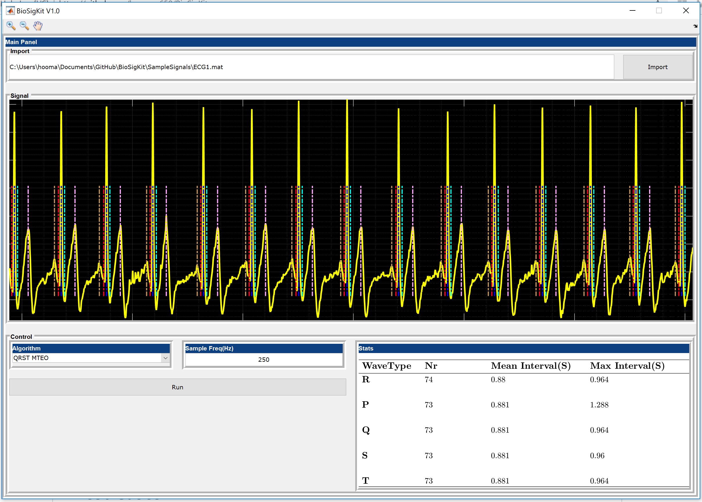

<!-- Main -->

<!-- One -->
<section id="one">
	

		<header class="major">
			<h2>What is a Biosignal?</h2>
		</header>
		
According to WikiPedia, a biosignal is any signal in living beings that can be monitored or measured. Our body works like a sophisticated machine with many main components such as heart, brain and etc.
		Each of these organs produces Action Potentials (AP) that could be measured with a differential amplifier attached to the electrodes placed close to that component. The best-known biosignals are:

		<ul>
		    <li><a href="https://en.wikipedia.org/wiki/Electrocardiography"><b>Electrocardiogram (ECG)</b></a></li>
			<li><a href="https://en.wikipedia.org/wiki/Electroencephalography"><b>Electroencephalogram (EEG)</b></a></li>
			<li><a href="https://en.wikipedia.org/wiki/Electromyography"><b>Electromyogram (EMG)</b></a></li>
			<li><a href="https://en.wikipedia.org/wiki/Accelerometer"><b>Accelerometer (ACC)</b></a></li>
		</ul>
		
In the following posts, I would share my experience with each of these signals and their applications. Please feel free to reach out if you have any questions or suggestions.

	

</section>

<!-- Two -->
<section id="two" class="spotlights">
	<section>
		
		

			

				<header class="major">
					<h3>Unsupervised ECG QRS Detection</h3>
				</header>
				
ECG is a biosignal produced by heart. Each wave in the ECG represents an action performed by different chambers and compartments of the heart.
Therefore, the abnormality or absense of each of these waves might indicate medically important diagnosis. In this post, we will get familiar with different waves in the ECG and implement a simple algorithm for QRS wave
detection. In the end, I will introduce BioSigKit, a toolbox that implements several QRS detection algorithms that you could simply use out of the box for your research purposes. 

				<ul class="actions">
					<li><a href="ECG-QRS.html" class="button">Learn more</a></li>
				</ul>
			

		

	</section>
	<section>
		
		

			

				<header class="major">
					<h3>Matlab BioSigKit</h3>
				</header>
				
In this post, I briefly introduce BioSigKit toolbox. BioSigKit is a set of useful signal processing tools in Matlab that are either developed by me personally or others in different fields of biosignal processing. BioSigKit is a wrapper with a simple visual interface that gathers this tools under a simple easy to use platform.

				<ul class="actions">
					<li><a href="Intro_BioSigKit.html" class="button">Learn more</a></li>
				</ul>
			

		

	</section>
	<section>
		
		

			

				<header class="major">
					<h3>Identifying Atrial Fibriliation (AFib) with Deep Convolutional Neural Networks (CNN)</h3>
				</header>
				
Harnesing the power of CNNs for one dimensional temporal signals

				<ul class="actions">
					<li><a href="DeepNetAFib.html" class="button">Learn more</a></li>
				</ul>
			

		

	</section>
</section>

<!-- Three -->
<section id="three">
	

		<header class="major">
			<h2>About me</h2>
		</header>
		
My name is hooman and I write blogs about AI, ML and DL and their applications in healthcare in my free time.

		<ul class="actions">
			<li><a href="zAbout.html" class="button next">Get to know me</a></li>
		</ul>
	

</section>

