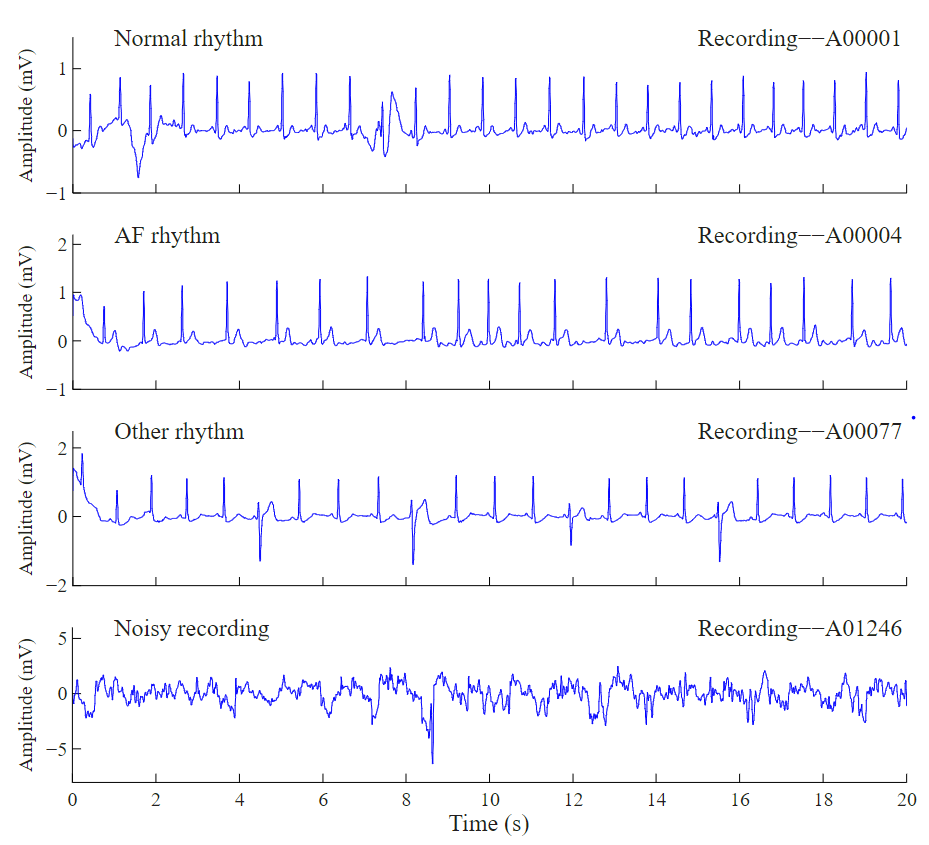
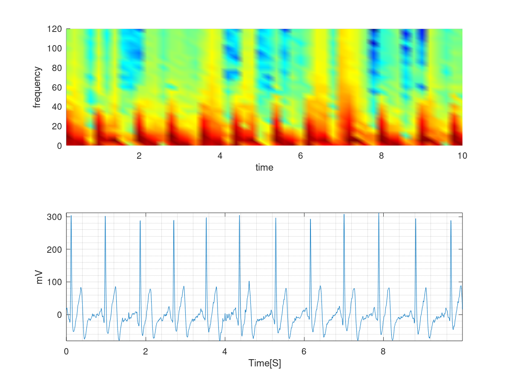
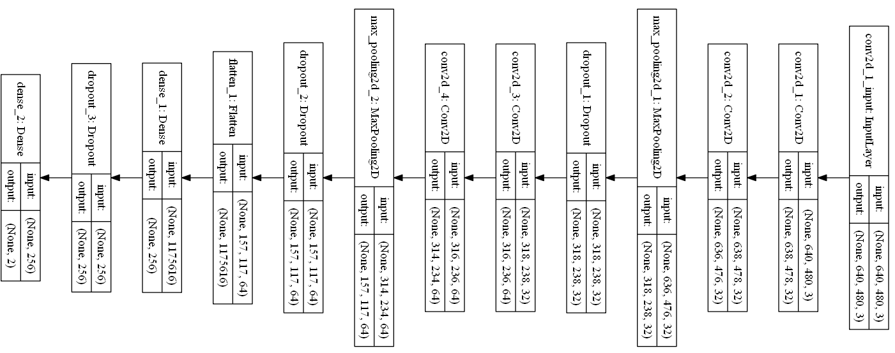

<!-- Main -->

<!-- One -->
<section id="one">
	

		<header class="major">
			<h2>What is Atrial Fibrilliation (AFib)?</h2>
		</header>
		
AFib is formally described as a “tachyarrhythmia characterized by predominantly uncoordinated atrial activation with consequent deterioration of atrial mechanical function” based on the American College of Cardiology (ACC), 
		the American Heart Association (AHA) and the European Society of Cardiology (ESC) <a href="https://physionet.org/content/challenge-2017/1.0.0/">[1]</a>. Apparantly, AFib is the most sustained form of arrhythmia, occurring in 1-2% of the general population and is directly attributed with 
		significant risk of stroke and heart failure. 

	

</section>

<section id="two" class="spotlights">
	<section>
		
		

			

				<header class="major">
					<h3>How does AFib look like?</h3>
				</header>
				
Ok enough with the fancy words. Lets look at some examples of the Electrocardigram (ECG) segments. The picture to the left indicates four different ECG rythms.
				The figure illustrates a normal rythm where beats are more or less uniformly spaced, AFib rythm where in the center, the beats get quite squished, an undefined and noisy segment respectively.
				In this article, we will be using the dataset from <a href="https://physionet.org/content/challenge-2017/1.0.0/"><b>Physionet Challenge 2017</b></a>. So, if you would like to replicate the results
				please go ahead and download the dataset now.

			

		

	</section>
</section>

<section id="one">
	

		<header class="major">
			<h2>What are we covering in this article?</h2>
		</header>
		
 If you are new to the field, you probably thought the only way to deal with one dimensional temporal signals
		such as sound, ECG, EMG and etc is to use good old Long Short Term Memory (LSTMs) networks. You have a signal and a label for it (if you are trying to classify it) and through it to an LSTM 
		network and voila. Unfortunately, LSTMs and RNNs have many <a href="https://towardsdatascience.com/the-fall-of-rnn-lstm-2d1594c74ce0"><i>drawbacks</i></a> and while they are designed to have a long memory, they often underperform.
		If you come from a signal processing background, you probably find CNNs very natural and intuitive. Many years ago before the rise of deep neural networks, we used convolution and filtering for enhancing signals 
		and extracting features from them. Liekwise, employed averaging and downsampling (pooling) to reduce redundancy. In image processing we employed high pass filtering to enhance the sharp edges in an image. 
		In this article, we employ a simple trick to convert 1d temporal signals to images and then apply the well-known CNNS such as VGG to classify AFib ECG segments.
		We will briefly touch on the following problems;
		

		<ul>
		    <li><i>How can we harness the power of CNNs for 1d temporal signals such as sound and ECG signals (LSTMs are boring and we all know it)?</i></li>
			<li><i>How do we handle the skewness and label imbalance in data (well, we have many healthy ECGs but not that many AFib examples)?</i></li>
			<li><i>How do we train large tensors using data generators (we will be creating a large tensor, how can we pass it as chunks for training to tensorflow)?</i></li>
			<li><i>How can we parallelize data transfer using generators (employing data generators comes with an extra bonus, parallelization!)?</i></li>
		</ul>
	

</section>

<section id="two" class="spotlights">
	<section>
		
		

			

				<header class="major">
					<h3>How to apply CNNs on 1D signals?</h3>
				</header>
				
Every 1d signal can be thought as a combination of sines and cosines. Meaning that it is possible to model a signal as 
				summation of sines and cosines with
				different frequencies and intensities. Probably, you remember the <a href="https://en.wikipedia.org/wiki/Fourier_transform">fourier transform</a>, 
				where a signal is transformed to its frequency 
				representation. Here, I employ a technique called <a href="https://ccrma.stanford.edu/~jos/sasp/Short_Time_Fourier_Transform.html">Short 
				Term Fourier Transform (STFT)</a>. STFT takes the fft over a small
				window of time in the signal and therefore, provides a time/frequency representation of it for that window. 
				The image to the left shows a segment of an ECG and its STFT on top. 
				The color coding indicates the amgnitude of the frequency, <i>Y</i> axis the frequency itself (Hz) and 
				<i>X</i> axis time respectively. As you can see this operation simply yields an image that could be passed 
				as a normal image to a CNN for classification.
				Mathematically speaking:
				
				$$STFT\{x[n]\}(m,\omega) \doteq \sum_{n=-\infty}^{\infty} x[n]w [n-m]e^{-j \omega n}$$
				
				Where, $\omega$ is the frequency and $w$ a window. If you are familiar with 
				the fourier transform you would notice that this simply is the fourier transform convolved with 
				a window $w$ of length $m$. 
				Now, please note that STFT suffers from the resolution problem, meaning that choosing a 
				large window would degrade resolution in time and small widnow in frequency domain respectively. A 
				better transformation would actually be taking the Continous Wavelet Transform (CWT) of the image which 
				does not suffer from this problem. I will leave this to you to compare the results of 
				this article to CWT.

			

		

	</section>
	<section>
		
		

			

				<header class="major">
					<h3>How does our VGG look like?</h3>
				</header>
				
Our CNN is a modified Visual Geometry Group (VGG) network. 
				I have rotated the network due to the limited space but you could read it from right to left. 
				It starts with an input 2D convolutional 
				layer that accepts images of size $640 \times 480$ and has several drop-out and max-pooling layers. There 
				are two more convolutional layers each containing 32 kernels. Then we have a max pooling layer and drop-out that help fight
				over-fitting. There are several more layers to further extract features.
				I chose a standard and simple (trust me this is simple compared to the massive recent networks) 
				for object detection to show you that the same structure performs as good for our task. If you do not have a GPU training such a network might be slow.
				So, feel free to remove layers and make this network smaller.

			

		

	</section>
	
</section>

<!-- One -->
<section id="one">
	

		<header class="major">
			<h2>Data preprocessing</h2>
		</header>
		
If you have already downloaded the dataset, you would see that all the ECG segments are stored in <i>.mat</i> format along with a <i>csv</i> file
		that assigns each segment a label. For thie tutorial, we would only try to estimate whether a segment is normal or AFib, so our classification is binary.
		
		Let's start by creating a class called <i>DeepNetAF</i>. This class would have a data importer routine and splitter. First make sure that you have the
		required packages such as numpy, scipy and keras. We also have a seperate script called self-made class called DataGenerator that we would talk about later.
		In the class below, we have <i>listFiles</i> and <i>ImportAllSigs</i> that take care of importing and dealing with the raw files. Then, we have <i>ComputePSD</i>
		and <i>CreateImage</i> that compute STFT, convert STFT to an image and then store that in a tensor respectively. Here, we also use a progress bar class to notify the 
		user how many files we have processed so far. You find this class in the bottom of this article too.
		

		<pre class="prettyprint lang-py">
		<code>
'''
Deep Learning FrameWork for atrial fibrillation (AF) classification. Here we
deal with the following questions:
    1. How can we harness the power of CNNs for 1d temporal signals such as ECG?
    2. How do we handle skewness and label imbalance in data?
    3. How do we train large tensors using data generators?
    4. How can we parallelize data transfer using generators?
Feb, 2020
Hooman Sedghamiz
'''

import os
import sys
import re
import random
from scipy.io import loadmat
from scipy.signal import stft
import matplotlib.pyplot as plt
import numpy as np
import pandas as pn
import keras
from shutil import copyfile
from DataGenerator import DataGenerator
class DeepNetAF(object):
    ReadPath = ""
    FilesToLoad = []
    Signals = np.array([])
    partition = {'train': [], 'validation': []}
    labels = {}
    # Parameters
    params = {'dim': None,
          'batch_size': 40,
          'n_classes': 2,
          'n_channels': 3,
          'shuffle': True}

    def __init__(self, PathR = os.path.realpath(__file__), AnnotN=None):
        '''
        Constructor for ApneaDeepLearning:
        PathR : The Path to Annotation Files default is current filename path.
        Example :  A = ApneaDeepLearning('D:/heartbeat/polysomnography/annotations-events-nsrr/baseline')
        '''
        self.ReadPath = PathR
        self.AnnotF   = AnnotN
        self.listFiles('.mat')

    def listFiles(self,Ext):
        '''
        Loads a set of files with extention input EXT : 'mat','xml'
        Ext : Extension of the file e.g. ".mat"
        Example :  listFiles(".mat")
        '''
        for file in os.listdir(self.ReadPath):
            if file.endswith(Ext):
                self.FilesToLoad.append(file)

    def ImportAllSigs(self,y_index, Fs=300):
        '''
        Imports all of the recordings in PathLoad
        Returns:
        A panda dataframe containing all of the patients

        Returns: A Tensor N*T*F (Number of trials * time-samples * Features)
        '''
        LD = ProgressBar(len(self.FilesToLoad), fmt=ProgressBar.FULL)
        ShortSegs = []
        true_index = []
        counter = 0
        for j,i in enumerate(self.FilesToLoad):
            LD()
            if y_index[j]:
                temp = self.ReadMatFile(i)
                d = temp.shape
                if d[0] < d[1]:
                    temp = np.transpose(temp)

                if j==0:
                    self.Signals = np.zeros((np.sum(y_index),temp.shape[0],1)) # Nr trials, timesteps, data_dim
                # --- Truncate the signal ------ #
                if temp.shape[0] > self.Signals.shape[1]:
                    temp = temp[:self.Signals.shape[1]]

                if temp.shape[0] == self.Signals.shape[1]:
                    self.Signals[counter,:,:] = temp
                    counter +=1
                    true_index.append(True)
                    #------------------ compute STFT ---------------------------#
                    if counter == 1:
                        f, t, PSD = stft(self.Signals[counter,:,0], Fs, nperseg=Fs/2)
                        PSD_img = self.CreateImage(f,t,PSD)
                        self.params['dim'] = tuple(PSD_img.shape[:2])
                    else:
                        _, _, PSD = stft(self.Signals[counter,:,0], Fs, nperseg=Fs/2)
                        PSD_img = self.CreateImage(f,t,PSD)
                    
                    #------------------ Save PSD to disk -------------------------- #
                    np.save(os.path.join('AFdata', 'id-'+ str(counter)), PSD_img)
                else:
                    true_index.append(False)
                    ShortSegs.append(j)
        self.Signals = self.Signals[:counter]
        LD.done()
        print(len(true_index))
        return true_index,ShortSegs

    def ComputePSD(self,Fs=300):
        '''
        Computes and saves PSD of the signals in self.Signals
        '''
        if self.Signals.size == 0:
            raise ValueError('No sequence found. First load the signals.')
        # --- Compute the ST-ft in non-overlapping windows of 0.5 sec --- #
        LD = ProgressBar(self.Signals.shape[0], fmt=ProgressBar.FULL)
        for i in range(self.Signals.shape[0]):
            LD()
            if i == 0:
                f, t, PSD = stft(self.Signals[i,:,0], Fs, nperseg=Fs/2)
                PSD = self.CreateImage(f,t,PSD)
                # ------------- Instantiate Image matrix RGB -------------- #
                x_train = np.zeros((self.Signals.shape[0], PSD.shape[0], PSD.shape[1], 3))
                # ------------- Create plots from PSD --------------------- #
                x_train[i,:,:,:] = PSD
            else:
                # ------------- Instantiate Image matrix RGB -------------- #
                _, _, PSD = stft(self.Signals[i,:,0], Fs, nperseg=Fs/2)
                # ------------- Create plots from PSD --------------------- #
                x_train[i,:,:,:] = self.CreateImage(f,t,PSD)

        LD.done()
        return x_train

    def CreateImage(self,f,t,PSD):
        '''
        Accepts frequency (f), time (t) and PSD and
        creates an image, then returns the image as a matrix.
        '''
        fig = plt.figure(frameon=False)
        ax = fig.add_axes([0, 0, 1, 1])
        ax.axis('off')
        plt.pcolormesh(t, f, np.abs(PSD), vmin=0)
        fig.canvas.draw()
        width, height = fig.canvas.get_width_height()
        test = fig.canvas.tostring_rgb()
        mplimage = np.fromstring(test, dtype=np.uint8).reshape(height, width, 3)
        plt.close('all')

        return mplimage

    def ReadMatFile(self,Fname):
        '''
        Read a .mat format file (Fname) and import to a np array
        '''
        # Read XML iteratively :  Only searches in ScoredEvents
        RF = os.path.join(self.ReadPath,Fname)
        # Import the signal
        Sig    = loadmat(RF)['val']

        return Sig
		</code>
	</pre>
	

</section>

<section id="one">
	

		<header class="major">
			<h2>Data balancing</h2>
		</header>
		
Unfortunately, the number of heathly segments are almost 7 times the AFib ones. If we train the network on this data without balancing the number of two groups,
		the network would simply assign a healthy label on all the trainings and still would acheive a high accuracy theoretically. Well, given that 
		the number of healthy cases are much more often, why would we need a network that labels all the inputs as healthy, then? Data skewness is a very common challenge and
		there are many ways to handle this. A simple way would be downsampling the more abundant class which means loss of data. That would not be a matter if we have enough number of samples
		in the smaller class. However, in our case, the AFib segments are sparse, so we would probably want to upsample them. There are many ways for image augmentation, such as tilting the data,
		zooming, or adding gaussian noise. However, here we would simply copy the smaller class 7 times, and we will see that even this simple method would work just fine.
		In the routines detailed below, we partition the data into validation and training set, import the annotation files and then upsample.
		

		<pre class="prettyprint lang-py">
<code>
    def SplitData(self,InputSize, trainSize = 0.9):
        '''
        Splits the input into test and train and returns the indices of them as
        test_label: Indices of test data
        train_label: Indices of training data
        Mask_B: Binary mask where the true bits represent the training samples and false bits the test
        '''
        Mask_B = np.zeros(InputSize, dtype = bool)
        train_label = random.sample(np.arange(0, InputSize).tolist(), round(trainSize*float(InputSize)))
        Mask_B[train_label] = True
        test_label = np.where(Mask_B==False)[0].tolist()

        return test_label, train_label, Mask_B

    def ReadAnnot(self,AnnotF):
        '''
        Import the annotation csv file
        '''
        if AnnotF != None:
            dataframe = pn.read_csv(os.path.join(self.ReadPath,AnnotF),header = None,engine='python',usecols=[1],squeeze = True)
            y_index  = np.logical_or(dataframe.str.contains("N"),dataframe.str.contains("A"))
            dataframe = dataframe[y_index]
            y_train = np.zeros((dataframe.shape[0],))
            y_train[dataframe.str.contains("A")] = 1
        else:
            raise ValueError('No Annotation File Provided!')

        return y_train,y_index

    def UpSample(self,ind, factor, total_size_data, TrainFlag = 'train'):
        '''
        Given the index of files, this function upsamples them by factor and saves the results in the same folder 
        and new ID which is incremented based on the total size of data

        TrainFlag :  Set to 'validation' if the data upsampled is for testing otherwise leave as default
        '''
        for i in ind:
            for j in range(0,factor):
                copyfile(os.path.join('AFdata','id-'+ str(i+1) + '.npy'),os.path.join('AFdata','id-'+ str(total_size_data+1) + '.npy'))
                self.partition[TrainFlag].append('id-'+str(total_size_data+1))
                self.labels['id-'+ str(total_size_data+1)] = self.labels['id-'+ str(i+1)]
                total_size_data += 1

    def Create_Partition(self, ind, y_train, TrainFlag = 'train'):
        '''
        Packs the labels (y_train) and data in a dictionary for keras generator
        Note: y_train should contain all of the labels for data
        '''
        for i in ind:
            self.partition[TrainFlag].append('id-'+str(i+1))
            self.labels['id-'+str(i+1)] = y_train[i]
</code>
	</pre>
	

</section>

<!-- data generator -->
<section id="one">
	

		<header class="major">
			<h2>Parallel Training using DataGenerators</h2>
		</header>
		
In the code snippet below, we create a class DataGenerator that would iteratively feed our tensor to keras. The great thing about a data generator 
		is its ability for parallelization. To read more about data generators see this <a href="https://stanford.edu/~shervine/blog/keras-how-to-generate-data-on-the-fly">excellent</a> blog.

<pre class="prettyprint lang-py">
<code>
import numpy as np
import keras
import os

class DataGenerator(keras.utils.Sequence):
    """
        This is a data generator that inherits from keras.utils.Sequence.
        It makes it easy to pass large training and validation data in parallel
        to keras for training.

        Adapted from https://stanford.edu/~shervine/blog/keras-how-to-generate-data-on-the-fly
        Afshine Amidi.

        Coded by Hooman Sedghamiz
        02/17/2019.
    """
    def __init__(self, list_IDs, labels, batch_size=32, dim=(32,32,32), n_channels=3,
             n_classes=2, shuffle=True):
        'Initialization'
        self.dim = dim
        self.batch_size = batch_size
        self.labels = labels
        self.list_IDs = list_IDs
        self.n_channels = n_channels
        self.n_classes = n_classes
        self.shuffle = shuffle
        self.on_epoch_end()

    def on_epoch_end(self):
        'Updates indexes after each epoch'
        self.indexes = np.arange(len(self.list_IDs))
        if self.shuffle == True:
            np.random.shuffle(self.indexes)

    def __data_generation(self, list_IDs_temp):
        'Generates data containing batch_size samples' # X : (n_samples, *dim, n_channels)
        # Initialization
        X = np.empty((self.batch_size, *self.dim, self.n_channels))
        y = np.empty((self.batch_size), dtype=int)

        # Generate data
        for i, ID in enumerate(list_IDs_temp):
            # Store sample
            X[i,] = np.load(os.path.join('AFdata', ID + '.npy'))
            # Store class
            y[i] = self.labels[ID]

        return X, keras.utils.to_categorical(y, num_classes=self.n_classes)

    def __len__(self):
        'Denotes the number of batches per epoch'
        return int(np.floor(len(self.list_IDs) / self.batch_size))

    def __getitem__(self, index):
        'Generate one batch of data'
        # Generate indexes of the batch
        indexes = self.indexes[index*self.batch_size:(index+1)*self.batch_size]

        # Find list of IDs
        list_IDs_temp = [self.list_IDs[k] for k in indexes]

        # Generate data
        X, y = self.__data_generation(list_IDs_temp)

        return X, y
</code>
</pre>

</section>

<!-- One -->
<section id="one">
	

		<header class="major">
			<h2>Training the network</h2>
		</header>
		
Finally, here is a little main function to instantiate our class, generate the CNN and train it using the DataGenerator class. In the last line we report the
			accuracy obtained on the validation data.

			
<pre class="prettyprint lang-py">
<code>
if __name__ == "__main__":
	'''
	Helper to test out the classes.
	'''
	# -------------- Initialize the class ---------- #
	data = DeepNetAF('training2017')
	# --------------Import labels ------------------ #
	y_train,y_index = data.ReadAnnot('REFERENCE-original.csv')
	# --------------Import ECG segments ------------ #
	y_index = data.ImportAllSigs(y_index)
	# --------Prepare training and validation------- #
	y_train = y_train[y_index[0][:]]
	normal_test_ind, normal_train_ind, _ = data.SplitData(sum(y_train==0))
	print('Nr of Test= %d , Nr Training= %d' % (len(normal_test_ind), len(normal_train_ind)))
	Afib_test_ind, Afib_train_ind, _ = data.SplitData(sum(y_train==1))
	print('Nr of Test= %d , Nr Training= %d' % (len(Afib_test_ind), len(Afib_train_ind)))
	
	#--------------- Partition Data ----------------#
	data.Create_Partition(normal_test_ind,y_train,TrainFlag = 'validation')
	
	data.Create_Partition(normal_train_ind,y_train)
	data.Create_Partition(Afib_test_ind,y_train,TrainFlag = 'validation')
	data.Create_Partition(Afib_train_ind,y_train)
	
	#------------- Upsample ---------------- #
	data.UpSample(Afib_train_ind, 7, len(y_train))
	data.UpSample(Afib_test_ind, 7, len(y_train),TrainFlag = 'validation')
	
	# ---------------- Generators ----------------------- #
	training_generator = DataGenerator(data.partition['train'], data.labels, **data.params)
	validation_generator = DataGenerator(data.partition['validation'], data.labels, **data.params)

	#------------- Create a simple VGG network----------- #
	model = keras.models.Sequential()
	# input: 100x100 images with 3 channels -> (640, 480, 3) tensors.
	# this applies 32 convolution filters of size 3x3 each.
	INP = list(data.params['dim'])
	INP.append(data.params['n_channels'])
	model.add(keras.layers.Conv2D(32, (3, 3), activation='relu', input_shape=tuple(INP)))
	model.add(keras.layers.Conv2D(32, (3, 3), activation='relu'))
	model.add(keras.layers.MaxPooling2D(pool_size=(2, 2)))
	model.add(keras.layers.Dropout(0.25))
	
	model.add(keras.layers.Conv2D(64, (3, 3), activation='relu'))
	model.add(keras.layers.Conv2D(64, (3, 3), activation='relu'))
	model.add(keras.layers.MaxPooling2D(pool_size=(2, 2)))
	model.add(keras.layers.Dropout(0.25))
	model.add(keras.layers.Flatten())
	model.add(keras.layers.Dense(256, activation='relu'))
	model.add(keras.layers.Dropout(0.5))
	model.add(keras.layers.Dense(2, activation='softmax'))
	model.compile(loss='binary_crossentropy', optimizer='rmsprop', metrics=['accuracy'])
	hist = model.fit_generator(generator=training_generator,
		validation_data=validation_generator,
		use_multiprocessing=True,
		workers=6)
	# -------------- Print Validation Accuracy --------------- #
	print(hist.history)

</code>	
</pre>
	

</section>

<!-- One -->
<section id="one">
	

		<header class="major">
			<h2>Conclusion</h2>
		</header>
		
Our netwrok achieves 88% of accuracy on the validation data, which is pretty impressive for a simple classifier without sophisticated data augmentation,
		and preprocessing. We saw here that even weak time-frequency representation of 1d signals using STFT (which suffers from resolution in Time/Frequency) could be a great way to train CNNs and achieve acceptable results. Employing CWT and 
		a more advanced data augmentation technique would help achieve even better results. Compare this with the results here with the LSTM network employed 
		in this <a href="https://www.mathworks.com/help/signal/examples/classify-ecg-signals-using-long-short-term-memory-networks.html"><b>blog</b></a> where even after feature
		extraction, the LSTM network achieves 83% of accuracy. check out my <a href="https://github.com/hooman650/DeepNetAFib"><b>DeepNetAFib repository</b></a> for the complete
		script of classes and scripts.

	

</section>

